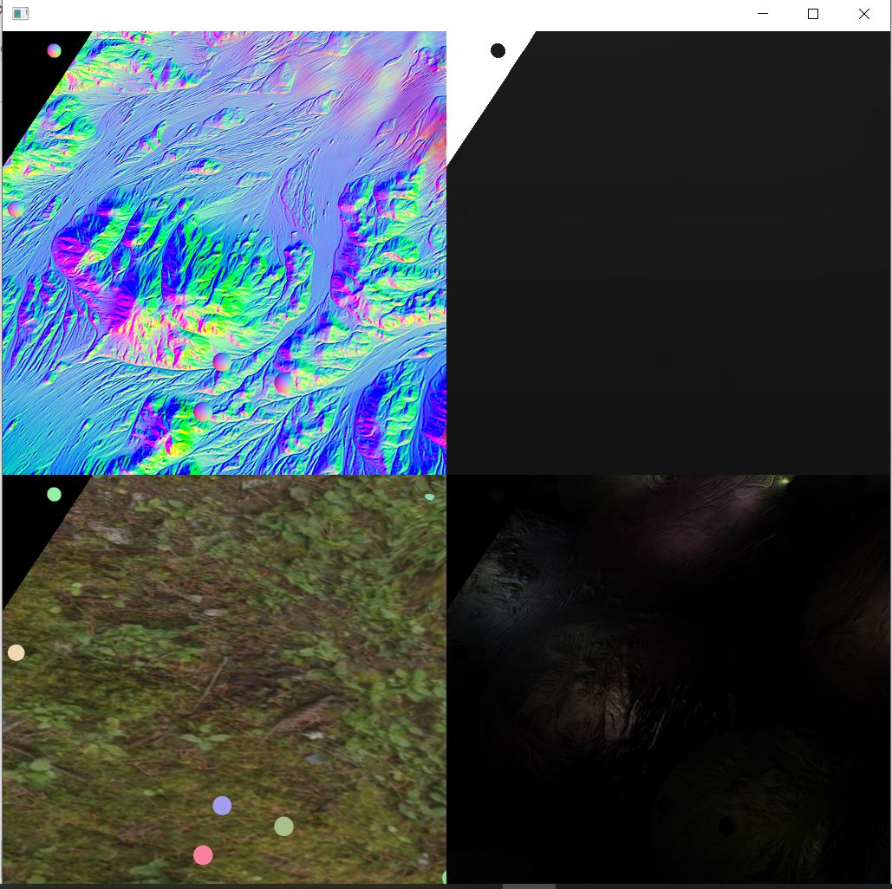

  

# Introduction

This is a cmake project that demonstrate deferred renedering implementation in [openscenegraph 3.6.4](http://www.openscenegraph.org). The sample contains a 
mesh terrain lighted with 150 light source in ~60 FPS (Release mode). This sample is based on several tutorials including

* https://learnopengl.com/Advanced-Lighting/Deferred-Shading
* http://ogldev.atspace.co.uk/www/tutorial35/tutorial35.html
* https://github.com/openscenegraph/OpenSceneGraph/blob/master/examples/osgdeferred/osgdeferred.cpp

## ScreenShoot

The sample include the rendering of gbuffer and lightpass.
* **Top Left**  : is the normal component of the gbuffer.
* **Top Right** : is the visualized depth component of the gbuffer.
* **Bottom Left**  : is the albedo component of the gbuffer.
* **Bottom Right** : is final light pass of the scene.

<h1 align="center">
   
  
</h1>

# Table of contant
1. [Prerequisite](#pre)

## Prerequisite
This openscenegraph project compiled using visual studio 2019 with 14.2 toolchain. It contains boost libraries dependencies. Some of the lightwight dependencies such as glew are included in this project
1. [Openscenegraph 3.6.4](https://github.com/openscenegraph/OpenSceneGraph)
2. [Boost Libraries 1.70](https://www.boost.org/users/history/version_1_70_0.html)

